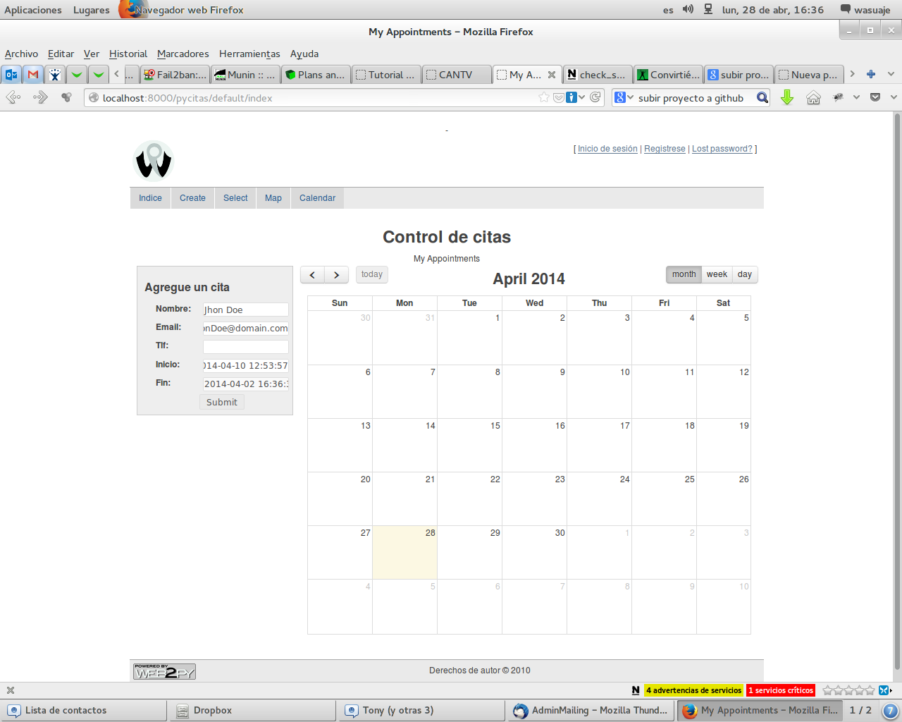
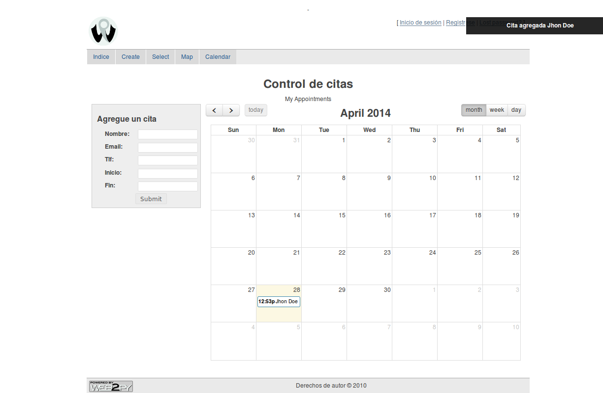
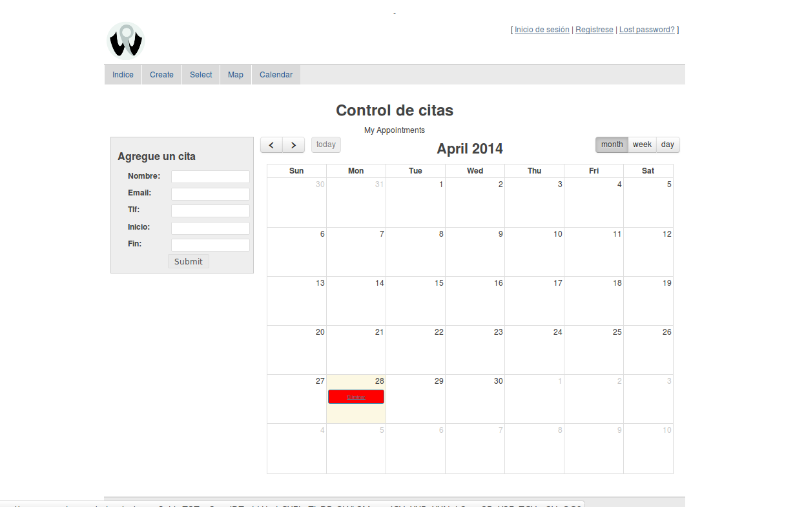

=======
Pycitas
=======

Es un proyecto WEB2py (Python), que hace fork al appliance: `AppointmentManager <http://http://github.com/mdipierro/web2py-appliances/tree/master/AppointmentManager>`_.

Requiere:
---------

::

 - Una cuenta en gmail.
 - Un calendario de google configurado como público.
 - La API googlecalendar habilitada.
 - La Autenticacion Oauth2 habilitada para lectura y escritura para inserts y deletes.

Instalacion:
------------

- Requiere las siguientes lineas en models/o.py

::

 settings.google_cal="https://www.google.com/calendar/feeds/yourgmailaccountgmail.com/public/basic"
 settings.google_calid="yourgmailaccount@gmail.com"

Insertando Citas:
-----------------

Eliminando citas:
-----------------

