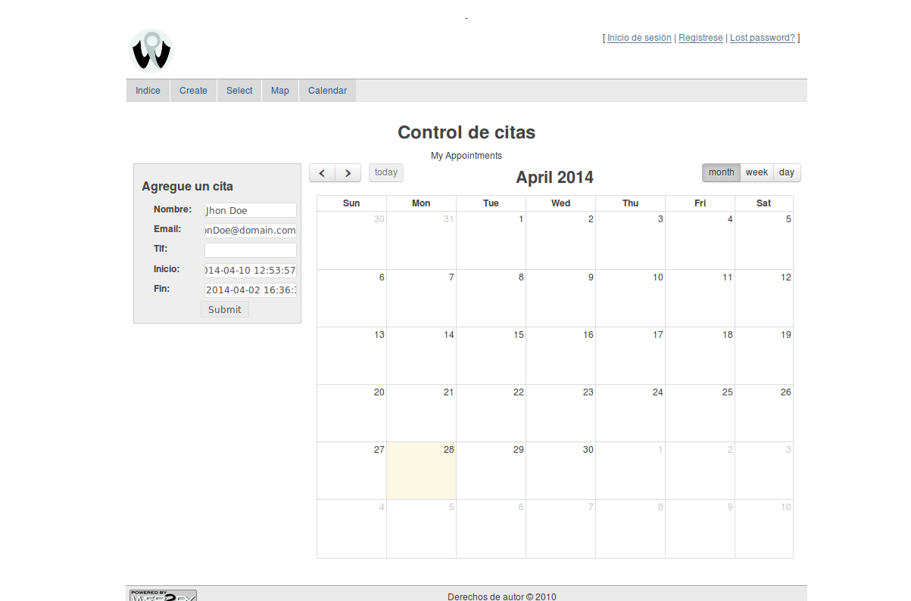

=======
Pycitas
=======

Es un proyecto WEB2py (Python), que hace fork al appliance: `AppointmentManager <http://http://github.com/mdipierro/web2py-appliances/tree/master/AppointmentManager>`_.

Requiere:
---------
1)Una cuenta en gmail.
2)Un calendario de google seteado como público.
3)La API googlecalendar habilitada
4)La Autenticacion Oauth2 habilitada para lectura y escritura para inserts y deletes

